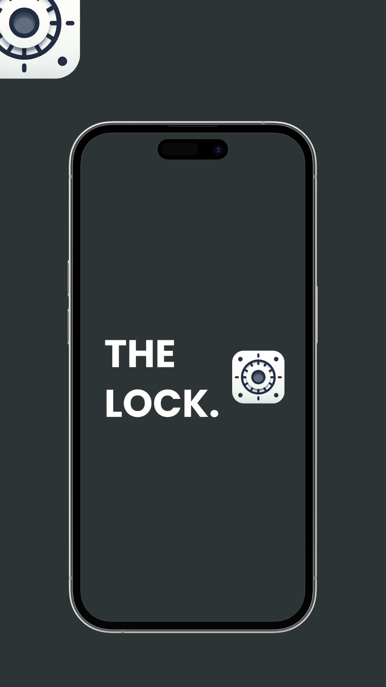
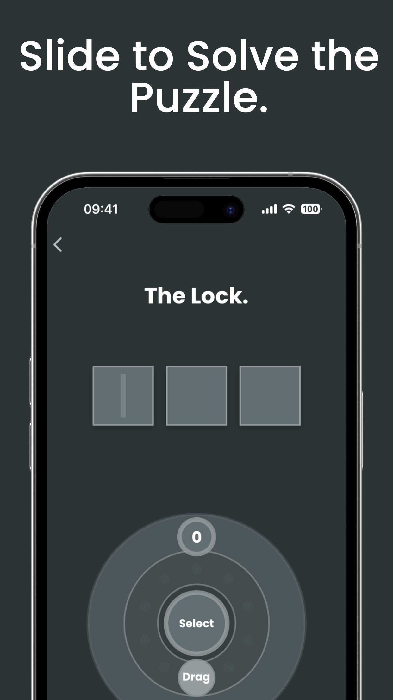
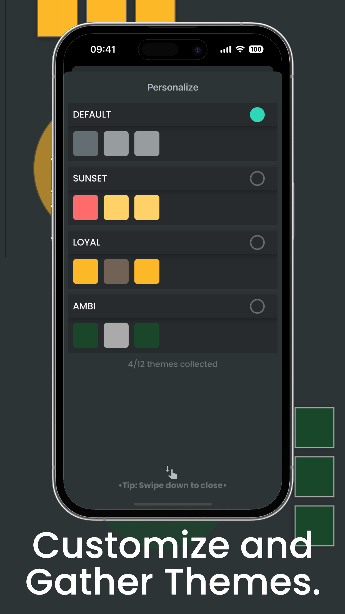

# The Lock: Game

Mobile application game developed with **React Native** and **Expo**. A game to guess numbers with a spinner. With haptic feedback and visuals as hints and collect different themes.


## Table of Contents
- [Screenshots](#screenshots)
- [Structure](#structure)
- [Features](#features)
- [Prerequisites](#prerequisites)
- [Dependencies](#dependencies)
- [Installation](#installation)
- [License](#license)

## Screenshots
&nbsp;&nbsp;

## Structure
The architectural blueprint for this app closely mirrors the **Atomic Design Pattern**.


- `Core Components`: Essential, reusable building blocks like buttons or text inputs.
- `Components`: Customized mix of core components, focused with specific logic.
- `Containers`: Predefined screen layouts. Here, components come together, shaped by page-specific logic (styles, animations...).
- `Screens`: Deploy containers, manage external business logic, like API communication (submit, get data...).

## Features
The current application offers:

- **Customization**: The application is built to support multiple themes and customization using `react-native-unistyles`
- **Full Offline**: The application is built full offline, no need any backend services.
- **Haptic Engine**: The application is using haptic engine to enhance the user experience.
- **Redux Toolkit (RTK)**: The application is using redux as global state management.
- **Expo**: The application is built with Expo.
- **In App Review**: The application offer in-app store review.

## Prerequisites
Ensure you have met the following requirements:

* You have installed the latest version of:
	*  `yarn`
	* `npx`
* Expo (**SDK 49**)

## Dependencies
The following major dependencies are used in the project:

- React (`react: 18.2.0`) 
- React Native (`react-native: 0.72.5`) as the main frameworks for building the app interface.
- Expo (`expo: 49.0.13`, `expo-haptics: 12.6.0`, `expo-font: ~11.4.0`, `expo-splash-screen: ~0.20.5`,) as the framework for bootstrapping the application.
- Redux (`redux: 4.2.1`, `@reduxjs/toolkit:1.9.7`) as global state management.


## Installation
Describe the installation process. Include the step-by-step process.

```bash
# Clone this repository
$ git clone git@github.com:jtvargas/TheLock.git

# Go into the repository
$ cd TheLock

# Install dependencies
$ yarn install

# Start the server
$ yarn start-clear-cache

```

### Run the app (**Simulator**)

**iOS**
- Run `yarn ios`

**Android**
- At the moment this app has been focused for iOS platform only, but you can try the android app using `yarn android`

### Run the app (**Device**)
This app is made with `Expo` so after start the server (`yarn start`) in the console will prompt a QR Code, you need to scan this code with your device camera.


## Supporting the project

You can support the maintainer of this project through the links below

[](https://www.buymeacoffee.com/dev0x07)

## License
Copyright 2023 © Jonathan Taveras